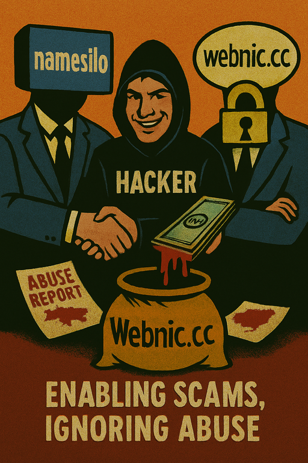

# 🛑 Nigerian Scam Infrastructure — AS36352 Exposure

  

> **Dataset:** This repository contains only a fraction of domains hosted on **two IP addresses** within **AS36352** (Betahost247, Nigeria).  
> Full ASN search results are available here:  
> - 🌐 https://urlscan.io/asn/AS36352  
> - 🌐 https://urlscan.io/search/#page.asn:%22AS36352%22

---

## 🚨 Executive Summary
Our OSINT investigation into Nigerian cybercrime infrastructure focused on **AS36352 (Betahost247)**.  
Even with a small dataset, the pattern is undeniable:  
> **We could not find a single legitimate website.**  

This ASN exists **exclusively** to host criminal content — phishing, fraud, scams, fake shops — all at scale.  

The key enablers are **three ICANN-accredited registrars**:
- **@namesilo**
- **@webnic_cc**
- **NiceNic**

These stand out because **virtually no other major ICANN registrar operates this way**.

**Not everyone can file such a report on behalf of a government agency** — but this FTC complaint proves it’s possible:  
It also shows that **most other abuse reports were simply ignored**.

---

## 🛡 How this ecosystem works
Scammers need:
1. **Hosting** that never takes them down.
2. **Domain registrar** that ignores abuse.
3. **Time** to operate.

  

**Betahost247 + Namesilo/Webnic** deliver all three:
- ❌ **No effective abuse handling.** Reports are ignored for weeks.
- ❌ **Even government abuse requests** are ignored without a direct court order.  
  *(Example: https://www.ftc.gov/system/files/ftc_gov/pdf/namesilo-wl-122024.pdf)*
- ❌ **Selective takedowns.** At most, 1 domain is suspended — never the scammer's whole account.
- ❌ **No KYC.** A $200 deposit and you can run anything:
  - Fake investments
  - Fake insurance
  - Cancer “cures”
  - Steroids
  - Weapons
  - Anything illegal — no questions asked.

This is not oversight. This is **systematic facilitation of cybercrime**.

---

## 🆚 Comparison to responsible registrars
Other large ICANN registrars (Namecheap, GoDaddy, Hostinger, etc.):
- ✅ Require KYC
- ✅ Respond to abuse in minutes
- ✅ Shut down **all domains** of the scammer

**Namesilo / Webnic**:
- ❌ Delay takedowns for **weeks**
- ❌ Keep scammer accounts active indefinitely
- ❌ Ignore clear ICANN Registrar Accreditation Agreement (RAA) **Section 3.18** obligations:
  - 3.18.1: Maintain abuse contact
  - 3.18.2: Investigate and respond to abuse reports

---

## 🌍 Scale of the problem
From our sample, scams target:
- 🇺🇸 United States
- 🇬🇧 United Kingdom
- 🌍 Victims worldwide

Content types include:
- Phishing for credentials and crypto wallets
- Investment scams
- Fake insurance sites
- Fake medical offers for cancer patients
- Sale of steroids and weapons

---

## 📈 Why it matters
Shutting down one domain **does nothing** if the scammer can instantly replace it.  

By keeping scammer accounts alive and ignoring abuse — even government requests — **Namesilo and Webnic** form part of the **core infrastructure of the black internet**.

These two registrars are effectively the **largest safe havens for global cybercrime**, with the entire criminal economy relying on them for:
- Stability
- Low risk of takedown
- Global reach

---

## 🔍 What should happen
- **ICANN Compliance** should immediately investigate **Namesilo** and **Webnic** for RAA 3.18 violations.
- Enforcement should require:
  - Full KYC for all new registrations
  - Suspension of entire scammer accounts upon confirmed abuse
  - Immediate compliance with legitimate government abuse notices
- Industry-wide policy change: Stop selling domains to known repeat abusers.

---

## 💬 Conclusion
**Betahost247, Namesilo, and Webnic** are not simply negligent — they are **active enablers of global scam infrastructure**.  

The **black internet**, the majority of large-scale scam campaigns, and the persistence of global phishing operations **depend** on their continued cooperation with criminals.  

Unless ICANN and regulators address the **root cause** — domain and hosting providers **protecting scammers** — the scale of cybercrime will remain unchanged.

---

**Review links:**
- https://www.trustpilot.com/review/nicenic.net  
- https://www.trustpilot.com/review/webnic.cc  
- https://www.sitejabber.com/reviews/namesilo.com  

✍ **Prepared by OSINT researchers**.  
This dataset is a **small sample** — yet it reveals the systemic abuse and lack of compliance that allows scammers to thrive for weeks instead of minutes.
